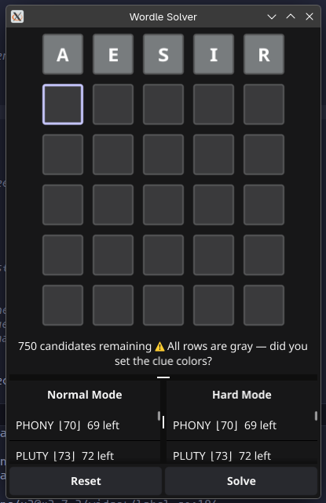
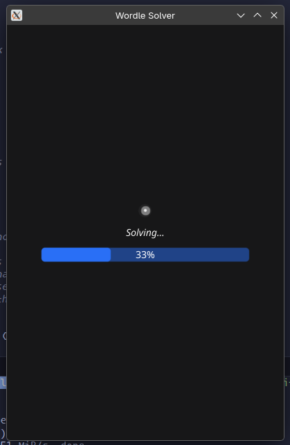
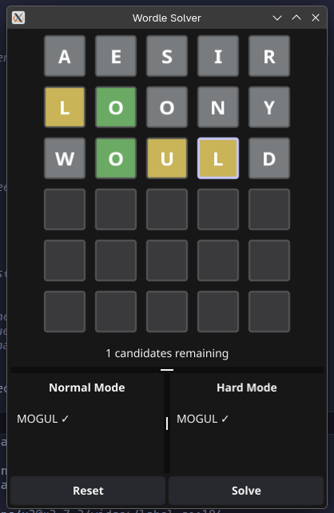

# Wordle Solver

A desktop Wordle solver built with Go and [Fyne](https://fyne.io/). Type in your guesses, set the clue colors, and get optimal next-guess suggestions ranked by worst-case performance.

## Features

- **Interactive tile grid** — type letters and click tiles to cycle clue colors (gray → yellow → green)
- **Partition-based solver** — uses recursive minimax to find guesses that minimize worst-case remaining candidates
- **Hard mode & normal mode** — hard mode only suggests valid candidates; normal mode considers all words
- **Parallel execution** — scales across all CPU cores
- **Adaptive search depth** — deeper analysis for smaller candidate pools (depth 3 under 50 candidates, depth 2 under 300, depth 1 otherwise)

## Screenshots





## How to Use

1. Type a word into the grid (or click a suggestion to insert it)
2. Click filled tiles to cycle their clue colors to match Wordle's feedback
3. Press **Enter** or click **Solve**
4. Pick a suggestion from the **Normal Mode** or **Hard Mode** lists
5. Repeat until solved

### Reading Suggestions

- `SALET  ⌊3⌋  290 left` — worst-case depth of 3, largest partition has 290 candidates
- `CRANE ✓` — only one candidate remains; this is the answer

## Install

### Requirements

Install **[Go 1.21+](https://go.dev/dl)** and a C compiler:

#### macOS
```sh
brew install go
xcode-select --install
```

#### Linux (Debian/Ubuntu)
```sh
sudo apt-get install golang-go build-essential libgl1-mesa-dev libx11-dev libxrandr-dev libxinerama-dev libxcursor-dev libxi-dev
```

#### Linux (Arch)
```sh
sudo pacman -S go base-devel libx11 libxrandr libxinerama libxcursor libxi
```

#### Windows
```powershell
winget install golang.go winlibs
```

### Run

Once dependencies are installed:

```sh
go install github.com/Kyza/wordle_solver@latest
wordle_solver
```

**Note for Windows users**: By default, `go install` may display a console window alongside the GUI. To avoid this, use one of the build options below (recommended).

### Build from Source

```sh
git clone https://github.com/Kyza/wordle_solver.git
cd wordle_solver
go build -o wordle-solver .
./wordle-solver
```

#### Windows (hide console window)

To build without the console window, use the `-H=windowsgui` linker flag:

**Option 1**: Using the Makefile (recommended if you have `make` installed)
```powershell
make build-windows
.\wordle-solver.exe
```

**Option 2**: Manual build with linker flag
```powershell
go build -ldflags "-H=windowsgui" -o wordle-solver.exe .
.\wordle-solver.exe
```

Both approaches add the `-H=windowsgui` flag, which tells the Go linker to link with the Windows GUI subsystem instead of the console subsystem. This prevents the cmd window from appearing when you launch the app.

## Running Tests

```sh
go test ./...
```

## Word List

The solver uses a ~14,855-word list from [tabatkins/wordle-list](https://github.com/tabatkins/wordle-list) (MIT license, see `LICENSE-words.txt`).
